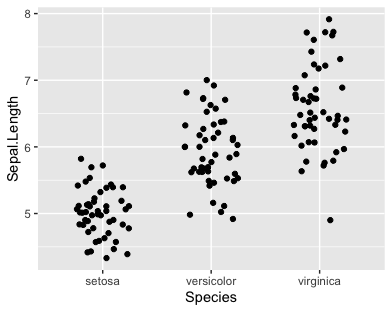

*bold*

To make a plot we use the ggplot() function.

###### header6

# Header 1

### Plotting

-   Github

-   hiiii

    ```{r}
    #this is a comment
    library(ggplot2)

    ggplot(data = iris, aes(x = Species, y = Sepal.Length)) +
      geom_point()
    ```

Add text between chunks

```{r}

```
